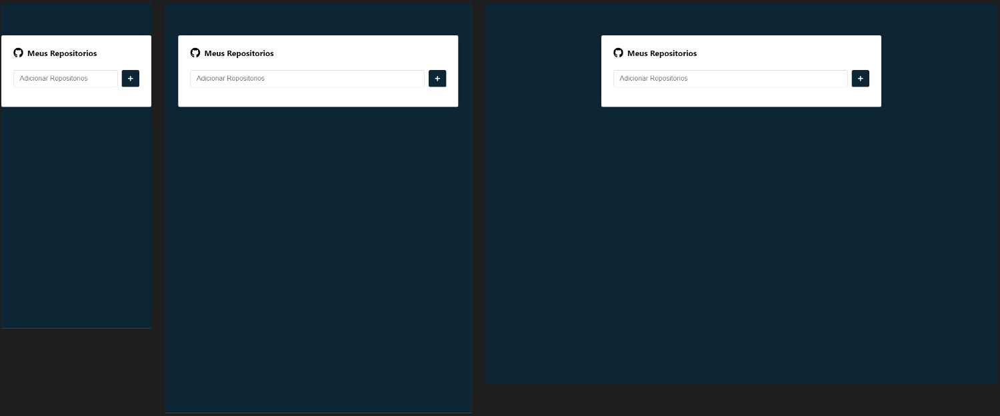

# Repositórios

Aplicação para salvar meu repositórios favoritos.

## ✔️ Técnicas e tecnologias utilizadas

Lista de tecnologias que foram usadas nesse projeto:

## 🛠️ Abrir e rodar o projeto

Para abrir e rodar o projeto, execute npm i para instalar as dependências e npm start para iniciar o projeto.

Depois, acesse <a href="http://localhost:3000/">http://localhost:3000/</a> no seu navegador.

## 📚 Mais informações

Entre em contato pelo [linkedin](https://www.linkedin.com/in/grazziano-fagundes/).
